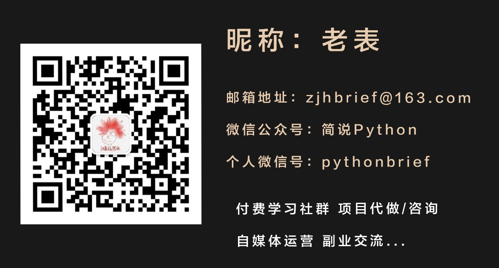

[toc]

先正面回答一下问题，需要多久：**入门一周+选定方向一周+进阶学习三个月**，整体算下来就是**3个月2周**的时间，这个过程最主要的是**坚持和坚守**，坚持就是坚持走下去，不要停歇；坚守就是坚守如一，选定方向和教程就不要更换。

## 一、首先是入门

入门比较建议找一个视频课程，花一周时间快速过掉（不用担心掌握的不牢固，因为在后面进阶学习中也会涉及基础知识回顾）。

入门阶段最重要的是：**环境搭建和多敲代码、解决问题**。

### 环境搭建

环境搭建是一切好的开始的基础，就像建房子打地基一样，对于初学者来说，环境搭建也是最容易出错、卡壳的地方，运气好，可能跟着教程一下就好了，运气不好，可能弄个两三天还是不行。

所以为了学习积极性不被打击，我建议初期可以看看周边有没有什么朋友是了解相关知识的，多请教下，实在没有，你也可以通过微信私信我你的问题，看到后就会给你解答。

环境搭建推荐查看以下文章：

[Windows/Mac 安装、使用Python环境+jupyter notebook](https://mp.weixin.qq.com/s?__biz=MzUyOTAwMzI4NA==&mid=2247510991&idx=1&sn=8331416e8c762c26c43c08691736ee64&scene=21#wechat_redirect)

[Mac下玩转Python-安装&使用Python/PyCharm](https://mp.weixin.qq.com/s?__biz=MzUyOTAwMzI4NA==&mid=2247486567&idx=1&sn=84804c803d998403f522a6e3e9f07fbd&scene=21#wechat_redirect) 

[Windows下安装、使用Pycharm教程，这下全了](https://mp.weixin.qq.com/s?__biz=MzUyOTAwMzI4NA==&mid=2247516661&idx=2&sn=6170d4b6d90d14422c88473a1295d573&scene=21#wechat_redirect) 

**多敲代码**

基础学习的时候记住，千万不要觉得前期是理论知识，多记多背就可以了，学习编程最主要的是需要多敲代码，多复现视频或者图书中的代码，在这个过程中你不止会积累敲代码的经验，你还会积累很多解决问题的经验。

**问题怎么解决**

在说下，初学遇到问题怎么解决，一般有以下几种解决方法：

1）自己根据报错提示，检查代码问题

2）仔细核对视频或者图书中的代码和自己写的有何不同

3）浏览器搜索错误提示，一般你遇到的问题，其他人都遇到过～

4）请教认识的相关领域学习者（比自己厉害就行，越厉害越好～），请教的时候记住，仔细描述问题，一般问题描述模板：

xx你好，我最近学习python遇到这个问题，多方尝试没有解决，向你请教下，
问题：错误描述，如：TypeError: Cannot perform 'ror...
我尝试解决方案：xxx,xxx,xxxx
相关代码截图：xxx
相关报错截图：xxxx

记住，和“大佬”交流别问：在不在；能不能帮忙解决个问题；想向你请教下，有没有时间...如果真觉得不好意思，不太熟的人，发个红包表示诚意就行，然后直接抛问题，不浪费彼此的时间。

5）可以到一些论坛提问

这个解决方案顺序是依次向下的，能自己解决最好自己解决，一个问题卡壳超过一个小时或者更多时间已经影响自己学习心态了，就不要硬肝了，像大佬或者互联网求助～

具体学习资料和学习路线啥的，大家网络中直接搜索就可以了，善用浏览器，选定一个就行，记住，初期学习一定要坚持。

## 二、选定方向

Python的应用非常广泛，包括：爬虫、数据分析、web开发、算法、机器学习、人工智能等，所以在进阶学习前，你需要先选定一个方向，这非常关键，当然你可以都先去了解，简单学习下，然后选一个自己感兴趣的就行。

在选定方向的时候一定要注意，不要在一些不那么感兴趣的方向花费太多精力，所以这个阶段最好一周内结束，而且在这个过程你还得不断复习巩固前面的基础。

这个阶段你可以考虑多去网络上听一些免费的课程、或者是讲座，或者是找一些大佬进行语音交流，多去了解每个方向的发展前景，和具体需要做些什么，可以不用那么急想去快点写个高级爬虫，复现个机器学习算法等～

## 三、进阶学习

这里就很重要了，前面两步可以说都是打基础，这一步就是建高楼了。

首先根据你选定的进阶学习方向，在网络上选一门付费或者免费的教程，个人更推荐付费（99-500的样子），因为一般付费课程都会有配套的学习交流群和答疑老师，这对你学习会有很大的帮助。

这个阶段，你除了关注基础练习和相关行业了解外，你更应该多进行相关项目练习，多和其他人交流，只有不断的交流，分享，你才会汲取到更多知识，知识掌握的也会更牢固。

## 四、总结

最后总结下：首先需要打好基础（环境搭建、基础学习、问题解决思路），然后选定一个自己感兴趣且有发展前景的方向，然后选择一门相关方向的系列教程，坚持学习下去即可。加油，希望我们都学有所成。

具体学习资料和学习路线啥的，我就不推荐了，大家网络中直接搜索就可以了，善用浏览器，选定一个就行，记住，初期学习一定要坚持。

如果有需要，我后面也可以分享一些学习路线和相关资料，之前在公众号：简说Python也分享过一些学习资料，大家微信搜索：简说Python，回复：2021，即可获取。

如果你有什么其他想聊的，可以通过以下方式和我联系：

下期见！